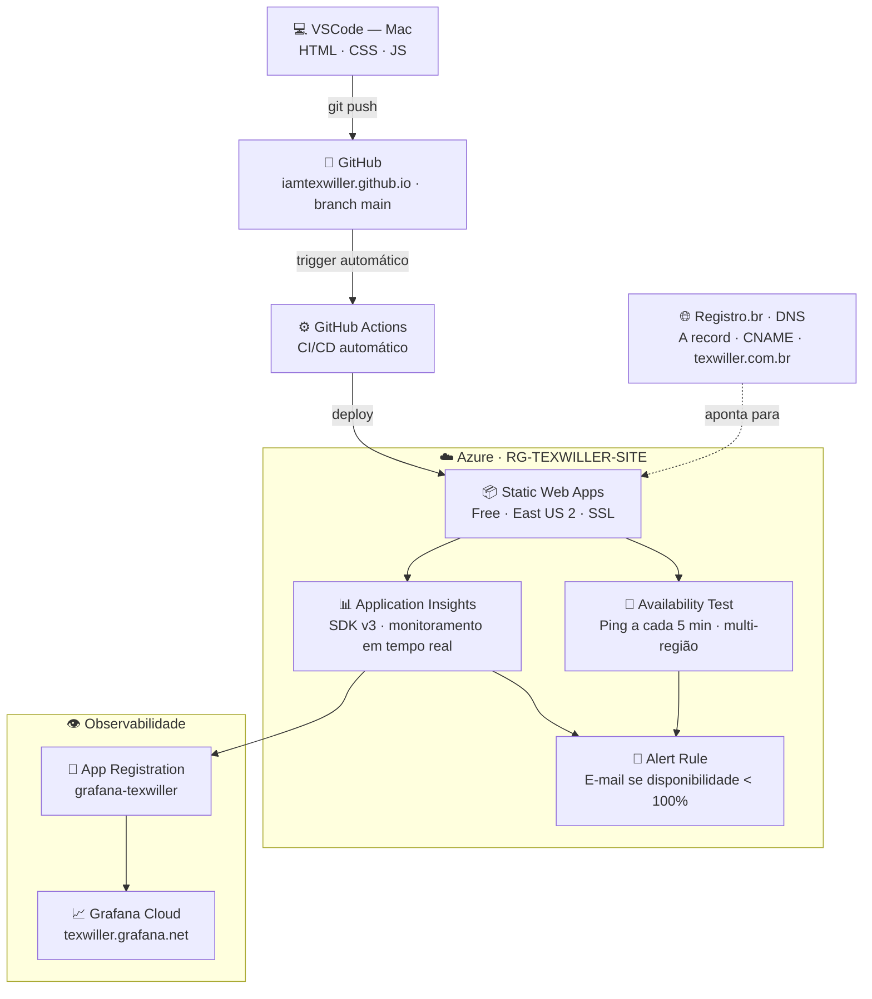
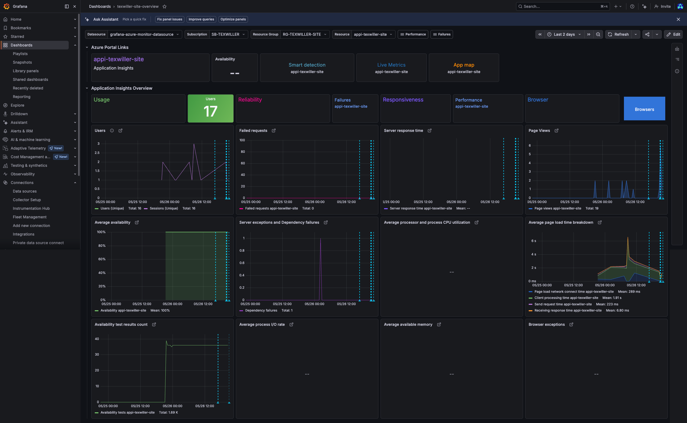

# texwiller.com.br — Site Pessoal

Este repositório contém o código do meu site pessoal de portfólio e currículo online, disponível em **[www.texwiller.com.br](https://www.texwiller.com.br)**.

O projeto foi construído do zero — do design ao deploy — sem frameworks, sem dependências e com infraestrutura profissional de monitoramento e observabilidade.

---

## 🎯 Objetivo

Criar uma presença digital profissional que refletisse minha trajetória em Cloud & Infraestrutura, de forma visualmente impactante e tecnicamente coerente com o meu perfil. Em vez de usar plataformas prontas como LinkedIn ou Notion, optei por construir e hospedar tudo eu mesmo — montando uma infraestrutura real com CI/CD, monitoramento, alertas e observabilidade.

---

## 🏗️ Como o site foi construído

O site é uma **página estática** — ou seja, não tem banco de dados, não tem servidor de aplicação, não tem backend. É HTML, CSS e JavaScript puro, servido diretamente para o navegador.

Essa escolha foi intencional: para um portfólio pessoal, não há necessidade de complexidade. O resultado é um site extremamente rápido, seguro e fácil de manter.

### Tecnologias utilizadas

- **HTML5** — estrutura semântica de toda a página
- **CSS3** — estilização completa com variáveis, CSS Grid, Flexbox e animações com keyframes. Nenhuma linha de CSS externo ou framework como Bootstrap foi utilizada
- **JavaScript Vanilla** — cursor customizado, animações de scroll com IntersectionObserver e navegação ativa. Sem jQuery, sem bibliotecas externas
- **Google Fonts** — tipografia com Bebas Neue, Syne e JetBrains Mono, carregadas via CDN

### Decisões de design

O visual foi pensado para ser impactante e memorável, fugindo do padrão genérico de portfólios. As principais escolhas foram:

- **Fundo preto puro (`#000`)** com texto claro para máximo contraste e visual editorial
- **Verde limão (`#c8ff00`)** como cor de destaque — forte, incomum e marcante
- **Tipografia grande e bold** com Bebas Neue nos títulos, transmitindo autoridade
- **JetBrains Mono** no corpo do texto, fazendo referência sutil ao universo técnico
- **Cursor customizado** que reage ao hover dos elementos interativos

---

## 📁 Estrutura do projeto

O código foi organizado em arquivos separados desde o início, seguindo boas práticas de desenvolvimento:

```
iamtexwiller.github.io/
│
├── index.html             → Estrutura HTML completa da página
│
├── css/
│   └── style.css          → Todo o visual: variáveis, layout, animações e responsivo
│
├── js/
│   └── main.js            → Cursor, scroll reveal e navegação ativa
│
├── assets/
│   └── *.png              → Badges das certificações (Credly e Microsoft Learn)
│
└── .github/
    └── workflows/
        └── azure-static-web-apps-*.yml   → Pipeline de CI/CD gerado pela Azure
```

---

## ☁️ Como o site está hospedado

Toda a infraestrutura foi montada do zero, com foco em boas práticas de Cloud, observabilidade e alertas — o mesmo stack utilizado em ambientes corporativos de missão crítica.



### Serviços utilizados

| Serviço | Função | Custo |
|---|---|---|
| **GitHub** | Versionamento do código e gatilho do pipeline de deploy | Gratuito |
| **GitHub Actions** | CI/CD — executa o deploy automaticamente a cada push | Gratuito |
| **Azure Static Web Apps** | Hospedagem do site com SSL e CDN global | Gratuito (Free tier) |
| **Azure Application Insights** | Monitoramento de performance, visitas e comportamento em tempo real | Gratuito (até 5GB/mês) |
| **Azure Monitor — Availability Test** | Ping automático a cada 5 minutos para verificar disponibilidade | Gratuito |
| **Azure Monitor — Alert Rule** | Alerta por e-mail se a disponibilidade cair abaixo de 100% | $0.10 USD/mês |
| **Grafana Cloud** | Dashboard de observabilidade conectado ao Azure Monitor | Gratuito (Free tier) |
| **Registro.br** | Registro e gerenciamento do domínio `texwiller.com.br` | ~R$ 40/ano |

### Como o deploy funciona

O fluxo de atualização do site é completamente automatizado. Basta editar o código localmente e enviar para o GitHub:

```
Edito o código no VSCode (Mac)
            │
            │  git add . && git commit && git push
            ▼
    GitHub — branch main
            │
            │  GitHub Actions detecta o push
            │  e executa o workflow automaticamente
            ▼
    Azure Static Web Apps
            │
            │  Build e deploy em ~1-2 minutos
            ▼
    www.texwiller.com.br ✅ atualizado
```

Não há etapas manuais após o push. O Azure cuida de tudo sozinho.

### Como o domínio está configurado

O domínio `texwiller.com.br` está registrado no **Registro.br**, que também gerencia o DNS. Os registros configurados são:

| Tipo | Nome | Destino |
|---|---|---|
| `A` | `texwiller.com.br` | IP do Azure Static Web Apps |
| `CNAME` | `www.texwiller.com.br` | `happy-forest-02982040f.7.azurestaticapps.net` |

O certificado SSL (HTTPS) é provisionado e renovado automaticamente pela Azure, sem nenhuma configuração adicional.

### Monitoramento com Application Insights

O site utiliza o **Azure Application Insights SDK v3** para monitoramento em tempo real. A implementação carrega o SDK diretamente via CDN da Microsoft e inicializa a instância após o carregamento completo:

```html
<script src="https://js.monitor.azure.com/scripts/b/ai.3.gbl.min.js" crossorigin="anonymous"></script>
<script type="text/javascript">
  var appInsights = new Microsoft.ApplicationInsights.ApplicationInsights({
    config: {
      connectionString: "..."
    }
  });
  appInsights.loadAppInsights();
  appInsights.trackPageView();
</script>
```

Essa abordagem garante que o SDK esteja completamente carregado antes da instância ser criada, evitando race conditions. Os dados coletados incluem:

- 📊 Page views e tempo de sessão
- 📱 Dispositivos e browsers utilizados
- 🌍 Localização geográfica dos visitantes
- ⚡ Performance de carregamento
- ❌ Erros e exceções JavaScript

### Disponibilidade e alertas

O **Azure Monitor Availability Test** realiza pings automáticos a cada **5 minutos** a partir de múltiplas regiões do mundo, verificando se o site está respondendo corretamente.

Caso a disponibilidade caia abaixo de **100%**, um **Alert Rule** dispara automaticamente um e-mail de notificação — garantindo visibilidade imediata sobre qualquer incidente.

```
Azure Monitor
    │
    │  Ping a cada 5 minutos (múltiplas regiões)
    ▼
www.texwiller.com.br
    │
    │  Disponibilidade < 100%?
    ▼
Alert Rule → E-mail de notificação imediata
```

### Observabilidade com Grafana

Os dados do Application Insights são visualizados em tempo real em um **Dashboard Grafana** hospedado no Grafana Cloud, conectado ao Azure Monitor via App Registration:

🔗 [texwiller.grafana.net](https://texwiller.grafana.net)

A integração foi configurada via **Azure App Registration** com as seguintes roles atribuídas:

| Role | Escopo | Finalidade |
|---|---|---|
| `Monitoring Reader` | Subscription | Leitura de métricas do Azure Monitor |
| `Log Analytics Reader` | Subscription | Leitura de logs do Log Analytics |

O dashboard exibe em tempo real:
- Usuários ativos e sessões únicas
- Page views por período
- Taxa de falhas (failed requests)
- Tempo de resposta do servidor
- Disponibilidade por região (Availability Test)
- **Anotações de deploy** — linhas verticais marcando cada deploy automaticamente via GitHub Actions

### Anotações de deploy no Grafana

Cada vez que um deploy é realizado, o **GitHub Actions** envia automaticamente uma anotação para o Grafana via API, marcando o exato momento do deploy em todos os gráficos do dashboard.

Isso permite correlacionar visualmente o impacto de cada mudança nas métricas do site — exatamente como é feito em ambientes de produção corporativos.

```yaml
- name: Annotate deploy on Grafana
  if: success()
  run: |
    curl -s -X POST https://texwiller.grafana.net/api/annotations \
      -H "Content-Type: application/json" \
      -H "Authorization: Bearer ${{ secrets.GRAFANA_TOKEN }}" \
      -d '{
        "dashboardUID": "tevf57m",
        "time": '"$(date +%s%3N)"',
        "tags": ["deploy", "github-actions"],
        "text": "🚀 Deploy — commit: ${{ github.sha }}"
      }'
```

### Dashboard — preview



### Organização dos recursos na Azure

```
Subscription : SB-TEXWILLER
    └── Resource Group : RG-TEXWILLER-SITE
            ├── Static Web App : texwiller-site
            │       ├── Plano     : Free
            │       ├── Região    : East US 2
            │       ├── Domínio   : www.texwiller.com.br
            │       └── CI/CD     : GitHub Actions
            │
            └── Application Insights : appi-texwiller-site
                    ├── Plano              : Free (5GB/mês)
                    ├── Região             : East US 2
                    ├── SDK                : ai.3.gbl.min.js
                    ├── Availability Test  : ping a cada 5 min
                    └── Alert Rule         : e-mail se disponibilidade < 100%

Grafana Cloud : texwiller.grafana.net
    └── Data Source : Azure Monitor
            ├── App Registration : grafana-texwiller
            ├── Roles            : Monitoring Reader + Log Analytics Reader
            └── Dashboard        : texwiller-site-overview
```

---

## 🏷️ Badges de certificação

As imagens das certificações são carregadas a partir da pasta `assets/`, com fallback automático para as fontes originais caso o arquivo local não exista:

| Certificação | Fonte da badge |
|---|---|
| AZ-104, SC-900, DP-900, PL-900, AI-901, AB-730, AB-731 | Microsoft Learn |
| AWS CCP, LPIC-1, VCTA-DCV, ITIL 4, Red Hat, Oracle OCI | Credly |
| GitHub Foundations | GitHub |
| CQPs FIAP | FIAP |

---

## 💰 Custo total da infraestrutura

| Item | Custo |
|---|---|
| Hospedagem (Azure Static Web Apps) | R$ 0,00/mês |
| Monitoramento (Application Insights) | R$ 0,00/mês |
| Availability Test | R$ 0,00/mês |
| Alert Rule | ~R$ 0,60/mês ($0.10 USD) |
| Grafana Cloud | R$ 0,00/mês |
| Domínio `texwiller.com.br` | ~R$ 3,33/mês (R$ 40/ano) |
| **Total** | **~R$ 3,93/mês** |

---

## 📄 Licença

Projeto open source. Sinta-se à vontade para usar a estrutura como base para o seu próprio portfólio — basta substituir o conteúdo.
